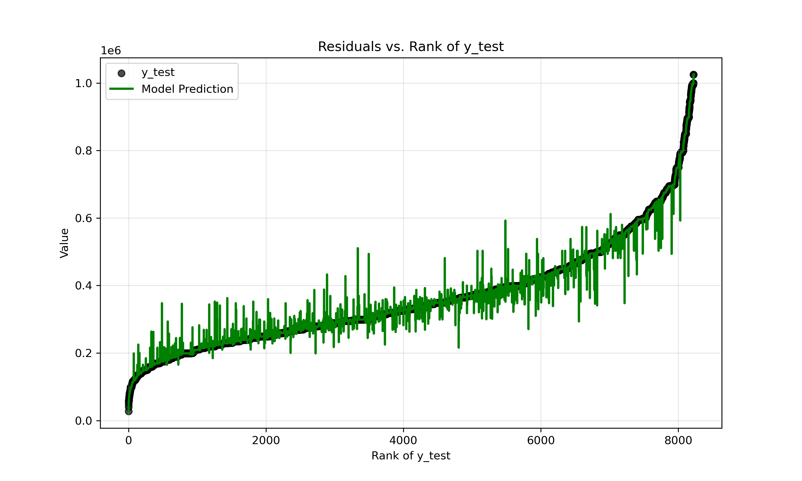

# **ImmoData - Model deployment using Streamlit**

[Introduction](#Introduction)    |    [Description](#Description)    |    [Installation-Environment setup](#Installation-Environment-setup)    |    [Usage](#Usage)    |    [Contributors](#Contributors)    |    [Timeline](#Timeline)

## **Introduction**

This repo contains the fourth and final project in a series aimed at completing a data science workflow from start (data collection) to finish (modelling using machine learning and deployment) during my AI and Data science bootcamp training at BeCode (Brussels, Belgium). The final goal is to create a machine learning model capable of predicting real estate prices in Belgium.

The specific aims for this project are :
1. Being able to deploy a machine learning model
2. Create a streamlit app that can handle a machine learning model

Specifications for the final app are:
- the app is capable of predicting a price, given user input for features retained in the model

## **Description**

### Remarks

- The model used for deployment was selected in a previous, modelling-specific, project.
- The model itself was not included in the repo due to size constraints for files on GitHub

### Model specifications

As a reminder, in the previous project a KNN regression model, allowing to predict property prices, was constructed using predictors scraped from a Belgian real estate website (ImmoWeb). The subset of predictor variables to be included in the model were chosen based on their correlation (for numerical features ; Spearman's ρ), or strength of interaction (for categorical features ; Kruskal-Wallis test) to the response variable. While some multicollinearity was detected amongst numerical predictors, decorrelation using PCA did not significantly improve the model's performance. The choice was made to make use of the raw predictors to allow better interpretation of the model. Other issues with the model, features and dataset are detailed in the previous project which can be found [here](https://github.com/kvnpotter/ImmoData-Modelling).

The retained features for price prediction are:
- **Postal code** ; categorical feature describing locality, but transformed to mean taxable income/locality (continuous). The transformation to a numerical predictor does not substantially improve the model, however it does remove possible issues with extrapolation (predictions of price using a postal code outside of the range of the training dataset)
- **Subtype of property** ; categorical feature with subdivisions as available on the ImmoWeb website
- **State of the building** ; categorical feature with subdivisions as available on the ImmoWeb website
- **Number of facades** ; integer, number of free facades to the property
- **Number of rooms** ; integer, number of bedrooms
- **Surface area of the plot of land** ; float, surface area of the plot of land in $m^2$
- **Living area** ; float, surface area of indoor spaces in $m^2$

The model itself was constructed using following parameters obtained using 5-fold cross-validation grid-search, with RMSE as optimization metric:
- **Distance metric** : Gower distance
- **n neighbours** : 17
- **weights** : inverse distance

**Caveat** : After fitting the model, substantial overfitting was detected (using $R^2$, MAE, RMSE, MAPE). This is clearly visible in the graph depicting actual and predicted price values, ordered by price. The best method found for dealing with the issue, given the dataset, was to restrict the price range, thereby excluding extreme values. The retained range is 200,000€ to 600,000€. **As a result, the model (and the app) should not be used to predict property prices lying (far) outside this range.** In addition, examination of the graph also indicates a systematic bias, where prices under the mean value are often overestimated, and prices over the mean are most often underestimated. This is taken to be a limitation of KNN regression, where averaging prices over 17 neighbours to make predictions results in values more close to the mean price.



Graph 1: Actual (black dot ; training dataset) and predicted (green line ; training dataset) prices, ordered by increasing actual price. The x axis represents the observation rank. The sigmoid form of the curve indicates few extreme values at the low and high price values. Predictions closely follow these extreme values, indicating overfitting. A systematic bias, where prices under the mean value are often overestimated, and prices over the mean are most often underestimated is visible

### Streamlit app code and data flow

The following text describes working of the Streamlit app and code.

Upon launching/resetting the app, a `Preprocessor()` object is created, allowing to prepare the data. Calling `load_data()` method on this object performs following actions:
- loading the original, scraped and cleaned, dataset
- loading additional tax data
- preparing and cleaning data for distance calculation (verifying data types, subsetting price range, subsetting features)
- creating lists for the dropdown inputs used in the app for property type, building state, number of rooms and facades and postcodes
- creating a lookup table for mean taxable income according to the postal code

Some information is presented to the user (title and warning pertaining to the price range). A sidebar contains dropdown elements or fields to input values used for price prediction.

Upon clicking the 'Predict price' button, the values are stored in a dictionary which is passed as an argument to the `preprocess()` method of the `Preprocessor()` object. Followng actions occur:
- obtain taxable income information from the lookup table and drop postal code
- calculate Gower distance

The calculation of Gower distance is performed by using training datapoint indices obtained from the previous modelling project, including the new datapoint (from user input), calculating a distance matrix and returning only the row of distances from the new datapoint to training datapoints.

A `Predictor()` obect is instantiated, passing the distance row as an argument, and loading the pre-trained model from a pickle file, after which the `predict()` method allows property price estimation.

Additionaly, a 95% confidence interval for the price estimation is generated using bootstrapping (1000 random resamples, with replacement).

Finally, the predicted price and associated confidence interval are shown to the user.

   ## **Installation-Environment setup**

You can create a virtual environment for the script using venv.
```shell
python -m venv C:\path\to\new\virtual\environment
```

Or using conda.
```shell
conda create --name <my-env>
conda activate <my-env>
```

Included in the repository is a cross-platform environment.yml file, allowing to create a copy of the one used for this project. The environment name is given in the first line of the file.
```shell
conda env create -f environment.yml
conda activate ImmoEliza
conda env list #verify the environment was installed correctly
```

## **Usage**

Once cloned, navigate to the repository directory. Using command prompt, with the environment activated, run following command to run the app.
```shell
streamlit run app.py
```

**Reminder** : running this code with a simple clone of this repo will not produce a functional app, since the model.pkl file was omitted due to size constraints.

# Contributors 
This project was completed by:
1. [Kevin](https://github.com/kvnpotter)

# **Timeline**

Start project: 11/12/2024 09:30
End project: 18/12/2024 12:30
